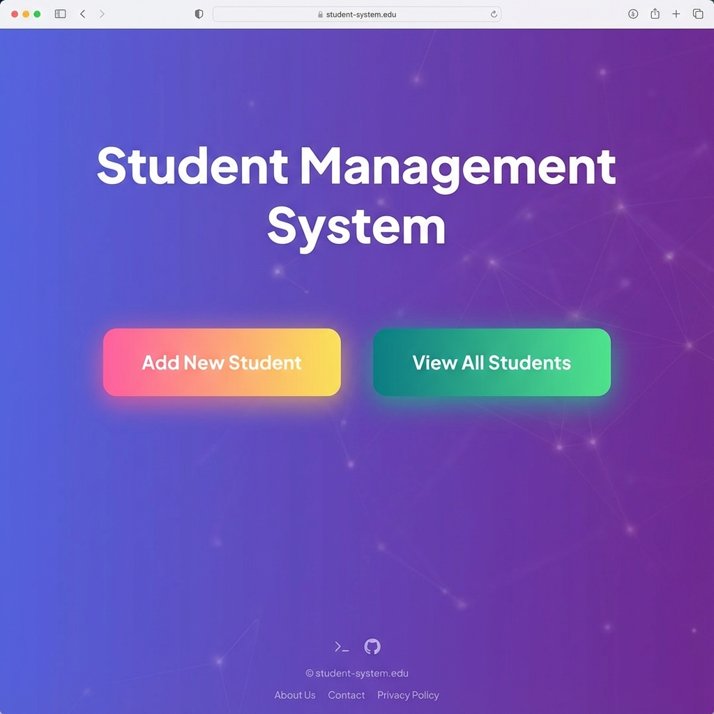
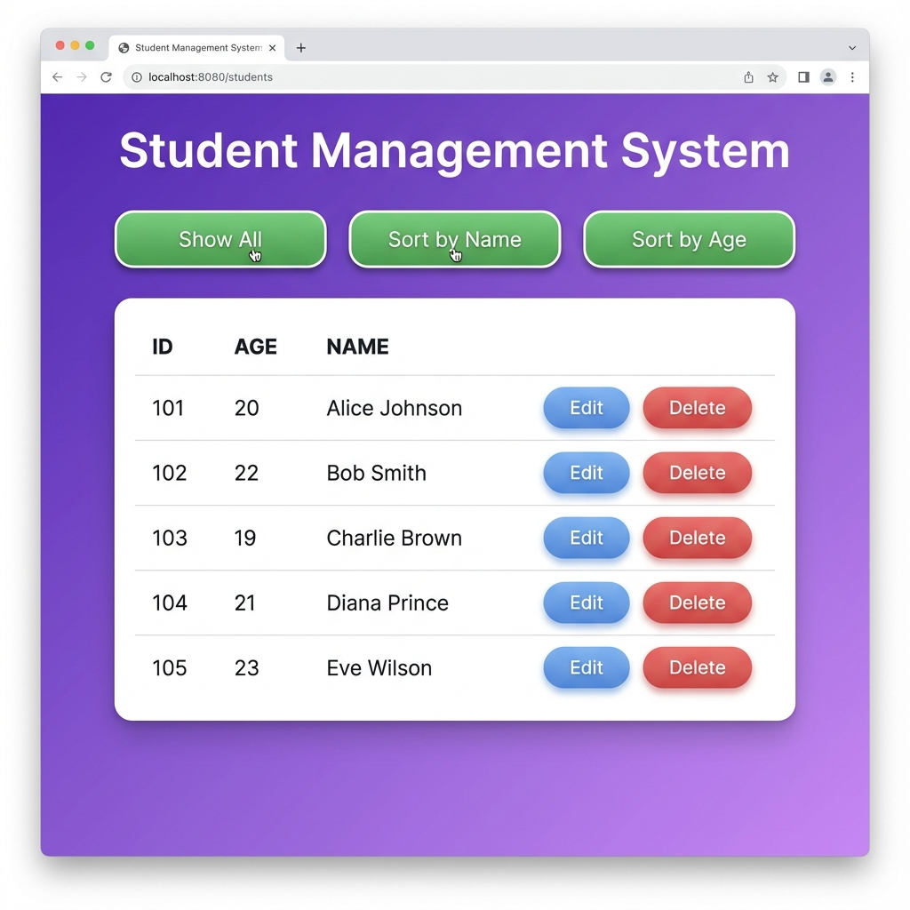
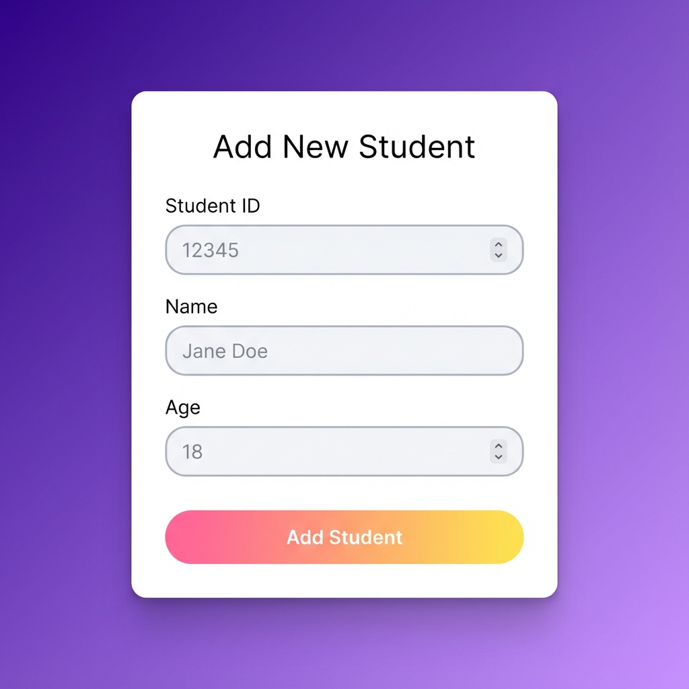

# 🎓 School Management System Projects

This repository contains **two complete Student Management System implementations** - one web-based and one console-based, both demonstrating full CRUD operations with PostgreSQL database integration.

---

## 📚 Projects Overview

### 1. SCHOOL - Web-Based Student Management System 🌐
A modern, full-featured web application with beautiful UI and complete CRUD operations.

**Technology Stack:**
- **Backend:** Java Servlets (Jakarta EE)
- **Frontend:** JSP, HTML5, CSS3
- **Database:** PostgreSQL
- **Server:** Apache Tomcat
- **Architecture:** MVC Pattern

**Features:**
- ✅ **Create** - Add new students with modern form UI
- ✅ **Read** - View all students with sorting capabilities
- ✅ **Update** - Edit existing student information
- ✅ **Delete** - Remove students with confirmation dialogs
- ✅ **Sort by Name** - Alphabetical ordering (A-Z)
- ✅ **Sort by Age** - Numerical ordering (youngest to oldest)
- ✅ **Modern UI/UX** - Gradient designs, smooth animations, responsive layout

### 2. SchoolManagement - Console-Based Student Management System 💻
A robust command-line application for managing student records.

**Technology Stack:**
- **Language:** Core Java
- **Database:** PostgreSQL with JDBC
- **Architecture:** Layered Architecture (Entity, Service, Driver)

**Features:**
- ✅ **Save** - Add new student records
- ✅ **Update** - Modify existing student data
- ✅ **Fetch All** - Display all students
- ✅ **Delete** - Remove student records
- ✅ **Input Validation** - Robust error handling
- ✅ **Menu-Driven Interface** - Easy navigation

---

## 🗂️ Repository Structure

```
eclipse-workspace/
├── SCHOOL/                          # Web-based application
│   ├── src/main/java/StudentManagement/
│   │   ├── entity/
│   │   │   └── Student.java         # Student model
│   │   ├── service/
│   │   │   └── StudentService.java  # Database operations
│   │   └── driver/
│   │       ├── StudentDriver.java   # Register servlet
│   │       ├── DisplayAll.java      # Display servlet
│   │       ├── EditStudent.java     # Edit servlet
│   │       ├── UpdateStudent.java   # Update servlet
│   │       └── DeleteStudent.java   # Delete servlet
│   ├── src/main/webapp/
│   │   ├── index.jsp                # Landing page
│   │   ├── register.jsp             # Add student form
│   │   ├── Display.jsp              # Student list page
│   │   └── update.jsp               # Edit student form
│   ├── COMPLETE_PROJECT_DOCUMENTATION.md
│   ├── QUICK_START.md
│   └── pom.xml
│
├── SchoolManagement/                # Console-based application
│   ├── src/main/java/school/
│   │   ├── entity/
│   │   │   └── Student.java         # Student model
│   │   ├── service/
│   │   │   └── StudentService.java  # Database operations
│   │   └── driver/
│   │       └── StudentDriver.java   # Main application
│   └── pom.xml
│
├── HOW_TO_RUN_SCHOOL_PROJECT.md     # Detailed run instructions
└── README.md                         # This file
```

---

## 🗄️ Database Schema

Both projects use the same PostgreSQL database schema:

### Database: `school`

```sql
CREATE TABLE student (
    id INTEGER PRIMARY KEY,
    age INTEGER NOT NULL,
    name VARCHAR(255) NOT NULL
);
```

### Sample Data

```sql
INSERT INTO student (id, age, name) VALUES
(1, 20, 'Alice Johnson'),
(2, 22, 'Bob Smith'),
(3, 19, 'Charlie Brown'),
(4, 21, 'Diana Prince'),
(5, 23, 'Eve Wilson');
```

### Database Configuration

- **Database Name:** `school`
- **Host:** `localhost:5432`
- **Username:** `postgres`
- **Password:** `123`

---

## 🚀 Quick Start

### Prerequisites

1. **Java Development Kit (JDK)** - Version 11 or higher
2. **Apache Tomcat** - Version 9.0 or higher (for SCHOOL project)
3. **PostgreSQL** - Version 12 or higher
4. **Maven** - For dependency management
5. **Eclipse IDE** (recommended) or any Java IDE

### Setup Steps

#### 1. Database Setup

```sql
-- Create database
CREATE DATABASE school;

-- Connect to school database
\c school

-- Create table
CREATE TABLE student (
    id INTEGER PRIMARY KEY,
    age INTEGER NOT NULL,
    name VARCHAR(255) NOT NULL
);

-- Insert sample data (optional)
INSERT INTO student (id, age, name) VALUES
(1, 20, 'Alice Johnson'),
(2, 22, 'Bob Smith'),
(3, 19, 'Charlie Brown');
```

#### 2. Clone the Repository

```bash
git clone https://github.com/ashishmishra3648/SERVLETS.git
cd SERVLETS
```

#### 3. Import Projects into Eclipse

1. Open Eclipse IDE
2. File → Import → Existing Maven Projects
3. Browse to the cloned repository
4. Select both `SCHOOL` and `SchoolManagement` projects
5. Click Finish

#### 4. Configure Database Connection

Update the database credentials in:
- `SCHOOL/src/main/java/StudentManagement/service/StudentService.java`
- `SchoolManagement/src/main/java/school/service/StudentService.java`

```java
private static String url = "jdbc:postgresql://localhost:5432/school";
private static String user = "postgres";
private static String password = "your_password";
```

---

## 🎯 Running the Projects

### SCHOOL (Web Application)

#### Method 1: Using Eclipse

1. Right-click on **SCHOOL project**
2. Select `Run As` → `Run on Server`
3. Choose Apache Tomcat server
4. Access the application at: `http://localhost:8080/SCHOOL/`

#### Method 2: Direct URL Access

After starting the server, access these URLs:

| URL | Description |
|-----|-------------|
| `http://localhost:8080/SCHOOL/` | Landing page |
| `http://localhost:8080/SCHOOL/register.jsp` | Add new student |
| `http://localhost:8080/SCHOOL/getall` | View all students |
| `http://localhost:8080/SCHOOL/getall?sortBy=name` | Students sorted by name |
| `http://localhost:8080/SCHOOL/getall?sortBy=age` | Students sorted by age |

### SchoolManagement (Console Application)

1. Right-click on `StudentDriver.java`
2. Select `Run As` → `Java Application`
3. Use the menu-driven interface:
   - Enter `1` to Save Student data
   - Enter `2` to Update Student data
   - Enter `3` to Fetch All Student data
   - Enter `4` to Delete Student data
   - Enter `5` to Close application

---

## 📸 Screenshots

### SCHOOL Web Application

#### Landing Page


#### Student List with Sort Options


#### Add Student Form


#### Edit Student Form


### SchoolManagement Console Application

#### Main Menu


#### CRUD Operations


---

## 🎨 SCHOOL Project Features

### UI/UX Highlights

- **Modern Gradient Design** - Purple to Violet theme
- **Responsive Layout** - Works on all devices
- **Smooth Animations** - Hover effects and transitions
- **Interactive Buttons** - Color-coded for different actions
- **Confirmation Dialogs** - Prevent accidental deletions
- **Form Validation** - Client-side and server-side validation

### Color Scheme

- **Primary:** Purple to Violet (#667eea → #764ba2)
- **Success:** Teal to Green (#11998e → #38ef7d)
- **Warning:** Pink to Red (#f093fb → #f5576c)
- **Add Button:** Pink to Yellow (#fa709a → #fee140)
- **Delete Button:** Orange to Yellow (#fc4a1a → #f7b733)

---

## 🔧 Technical Architecture

### SCHOOL Project (MVC Pattern)

```
┌─────────────┐
│   Browser   │
└──────┬──────┘
       │
       ▼
┌─────────────┐
│  JSP Views  │ ◄── Display.jsp, register.jsp, update.jsp
└──────┬──────┘
       │
       ▼
┌─────────────┐
│  Servlets   │ ◄── StudentDriver, DisplayAll, EditStudent, etc.
│ (Controller)│
└──────┬──────┘
       │
       ▼
┌─────────────┐
│   Service   │ ◄── StudentService.java
│   Layer     │
└──────┬──────┘
       │
       ▼
┌─────────────┐
│  Database   │ ◄── PostgreSQL
└─────────────┘
```

### SchoolManagement Project (Layered Architecture)

```
┌─────────────┐
│   Console   │
└──────┬──────┘
       │
       ▼
┌─────────────┐
│   Driver    │ ◄── StudentDriver.java
│   Layer     │
└──────┬──────┘
       │
       ▼
┌─────────────┐
│   Service   │ ◄── StudentService.java
│   Layer     │
└──────┬──────┘
       │
       ▼
┌─────────────┐
│   Entity    │ ◄── Student.java
│   Layer     │
└──────┬──────┘
       │
       ▼
┌─────────────┐
│  Database   │ ◄── PostgreSQL
└─────────────┘
```

---

## 🐛 Troubleshooting

### Common Issues

#### Database Connection Failed
**Problem:** Cannot connect to PostgreSQL

**Solutions:**
1. Ensure PostgreSQL service is running
2. Verify database `school` exists
3. Check username and password in `StudentService.java`
4. Confirm PostgreSQL is listening on port 5432

#### Servlet Not Found (404)
**Problem:** URL returns 404 error

**Solutions:**
1. Verify `@WebServlet` annotations in servlet classes
2. Clean and rebuild the project
3. Restart Tomcat server
4. Check project deployment in Tomcat

#### No Data Displayed
**Problem:** Empty table or no records

**Solutions:**
1. Add students using the registration form
2. Check database: `SELECT * FROM student;`
3. Verify servlet is forwarding data correctly
4. Check browser console for JavaScript errors

#### Maven Dependencies Not Resolved
**Problem:** Build errors due to missing dependencies

**Solutions:**
1. Right-click project → Maven → Update Project
2. Check internet connection
3. Verify `pom.xml` is correctly configured
4. Clean Maven cache: `mvn clean install`

---

## 📚 Documentation

### Detailed Documentation Files

- **[COMPLETE_PROJECT_DOCUMENTATION.md](SCHOOL/COMPLETE_PROJECT_DOCUMENTATION.md)** - Comprehensive guide for SCHOOL project
- **[HOW_TO_RUN_SCHOOL_PROJECT.md](HOW_TO_RUN_SCHOOL_PROJECT.md)** - Step-by-step running instructions
- **[QUICK_START.md](SCHOOL/QUICK_START.md)** - Quick reference guide

---

## 🧪 Testing Checklist

### SCHOOL Project
- [ ] Add a new student via registration form
- [ ] View all students
- [ ] Sort students by name
- [ ] Sort students by age
- [ ] Edit a student's information
- [ ] Delete a student
- [ ] Verify database updates
- [ ] Test responsive design on mobile
- [ ] Check all button interactions
- [ ] Verify delete confirmation dialog

### SchoolManagement Project
- [ ] Save a new student
- [ ] Update existing student
- [ ] Fetch and display all students
- [ ] Delete a student
- [ ] Test input validation
- [ ] Verify database persistence
- [ ] Test application exit

---

## 📈 Future Enhancements

### Planned Features
- 🔍 Search functionality
- 📄 Pagination for large datasets
- 📧 Email field validation
- 📱 Phone number field
- 🎓 Grade/Class information
- 📊 Export to CSV/PDF
- 🔐 User authentication and authorization
- 📸 Student photo upload
- 📊 Dashboard with statistics
- 🔔 Notifications system

---

## 🤝 Contributing

Contributions are welcome! Please feel free to submit a Pull Request.

### How to Contribute

1. Fork the repository
2. Create your feature branch (`git checkout -b feature/AmazingFeature`)
3. Commit your changes (`git commit -m 'Add some AmazingFeature'`)
4. Push to the branch (`git push origin feature/AmazingFeature`)
5. Open a Pull Request

---

## 📝 License

This project is open source and available for educational purposes.

---

## 👨‍💻 Author

**Ashish Mishra**

- GitHub: [@ashishmishra3648](https://github.com/ashishmishra3648)
- Repository: [SERVLETS](https://github.com/ashishmishra3648/SERVLETS)

---

## 🙏 Acknowledgments

- PostgreSQL for the robust database system
- Apache Tomcat for the servlet container
- Eclipse IDE for the development environment
- Jakarta EE for servlet specifications

---

## 📞 Support

If you encounter any issues or have questions:

1. Check the [Troubleshooting](#-troubleshooting) section
2. Review the detailed documentation files
3. Open an issue on GitHub
4. Contact the author

---

## ✅ Project Status

**Status:** ✅ Complete and Fully Functional

**Last Updated:** December 22, 2025

**Version:** 1.0.0

---

**Happy Coding! 🎓✨**
